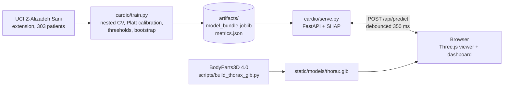

<div align="center">

# 🫀 Cardio3D

### Coronary artery risk, painted onto an interactive 3D heart, with every prediction explained

[](https://www.python.org/)
[](https://fastapi.tiangolo.com/)
[](https://scikit-learn.org/)
[](https://shap.readthedocs.io/)
[](https://threejs.org/)


**[▶ Live demo](https://cardio3d.onrender.com/)** · **[🎬 Demo video](https://youtu.be/w4nHYaHfXQo)** · **[📄 Documentation (PDF)](https://github.com/SoumyadeepChattopadhyay2004/Cardio3D/blob/3f72c5e4989874055c553488563407350d46084b/docs/Project%20Documentation%20_%20Multimodal%20Hackathon.pdf)** 

<!-- TODO: replace the three "#" links above with the Hugging Face / Render URL, the YouTube URL, and keep the two docs links. -->

<!-- TODO: add a hero screenshot or GIF, e.g. docs/figures/hero.png -->
<!--  -->

</div>

> **⚠️ Decision support and educational use only.** Nothing here is a diagnosis. Predictions do not replace
> coronary angiography, CT angiography or a clinician's judgement, and the models have not been validated on
> patients outside the dataset they were trained on. A warning is visible at the top and bottom of the screen at all times.

---

## Overview

Cardio3D takes a patient's routine clinical measurements (demographics, history, examination, ECG, laboratory
and echo findings) and answers four questions:

1. Does this patient have **coronary artery disease (CAD)**?
2. Is the **left anterior descending (LAD)** artery narrowed by 50% or more?
3. Is the **left circumflex (LCX)** artery narrowed by 50% or more?
4. Is the **right coronary artery (RCA)** narrowed by 50% or more?

Each answer is a **calibrated probability**. The three vessel probabilities colour the matching arteries on a
3D heart built from real **BodyParts3D** anatomy, and a dashboard explains, measurement by measurement, **why**
the model said what it said (SHAP). Everything runs in one browser tab backed by a small Python service, with
no CDN, web fonts or external requests, so it also works offline.

Built for **Track A: Cardiovascular Risk Visualization & Prediction**, on the UCI *Extension of Z-Alizadeh Sani*
dataset (303 patients, 55 input features after leakage removal).

### Highlights

- **Honest evaluation.** Nested, repeated 5-fold cross-validation over all 303 patients, so model selection never
  touches the data it is scored on. 95% bootstrap intervals for every metric.
- **Calibrated probabilities.** Platt scaling, cross-fitted for evaluation, with a separate decision threshold per target.
- **No leakage.** `LAD`, `LCX`, `RCA`, `Cath` and the overall CAD label are never model inputs. This is asserted in code and tested on the data and on the fitted pipelines.
- **Three levels of explanation.** A plain-language sentence, signed per-measurement SHAP bars with values and units, and a global importance view.
- **Dashboard and 3D view cannot disagree.** Both use the same green-to-red colour function, and an automated test checks the rendered colour of each artery against its probability.
- **Schema-driven.** A new dataset column appears in the form, explanation and importance view without front-end changes.
- **Runs on modest hardware.** Renders on demand, drops resolution while dragging, and has a lite mode for software-only graphics.

---

## How it works



Training runs offline and writes one bundle. The service loads it once and answers about 0.1 s per request
(four predictions plus explanations). Each edit in the form is debounced by 350 ms and sends one request; stale
replies are discarded.

---

## Quick start (about 3 minutes)

Requires **Python 3.11 or newer**. The trained models are included, so there is nothing to train.

```bash
git clone https://github.com/SoumyadeepChattopadhyay2004/Cardio3D.git
cd Cardio3D
python -m venv .venv
source .venv/bin/activate              # Windows PowerShell: .venv\Scripts\Activate.ps1
pip install -r requirements.lock       # exact tested versions (requirements.txt is a looser alternative)
uvicorn cardio.serve:app --port 8000
```

Open <http://localhost:8000>. Pick an example patient or edit any value on the left; the heart and the explanation
update about a third of a second after you stop typing. `make run`, `make test` and `make train` do the same
things if you have `make`.

> **Troubleshooting.** If the page says the model could not be loaded, check that `artifacts/model_bundle.joblib`
> exists and that `pip install` finished without errors (the bundle needs `pyarrow`). On Windows, keep the project
> outside synced folders such as OneDrive to avoid file-lock errors in `.git` and `.venv`.

### Using the viewer

| Do this | What happens |
|---|---|
| Drag / scroll | Rotate / zoom. While dragging, the scene renders at lower resolution to stay smooth |
| **Front**, **Back**, **Left** | Standard camera views |
| Hover over an artery or heart part | Tooltip with the anatomical name and, for arteries, the vessel's probability |
| Click an artery | Selects that vessel; the explanation switches to it |
| Click the ventricles, an atrium, the aorta, pulmonary or venous structures | Region card: supplying arteries, their probabilities, related echo findings |
| Click empty space | Back to overall CAD |
| **Skeleton** / **Heartbeat** | Hide the ribs and spine / toggle the beat animation |
| **Prediction** / **Performance** / **Importance** tabs | Patient explanation / cross-validated metrics, ROC and calibration / global SHAP importance |

On software-only graphics, or with `?lite=1` in the URL, the page switches to a lite mode: no antialiasing, lower
resolution and no idle animation.

---

## Results

Nested, repeated cross-validation over all 303 patients (3 × 5 outer folds): every number comes from patients the
model that predicted them never saw. Model choice happened inside the folds, probabilities are Platt-calibrated,
and each target has its own decision threshold chosen on other patients' predictions. Intervals are patient-level
bootstrap (500 resamples).

<!-- SYNC CHECK: these numbers must match artifacts/metrics.json of the exact bundle you ship and deploy.
     Regenerate this table after every retrain (python -m cardio.train ...) and keep it identical to the
     Performance tab in the app and to docs/Project_Documentation.pdf. -->

| Target | Final model | Threshold | ROC-AUC (95% CI) | Accuracy | Precision | Recall | Specificity | F1 | Brier |
|---|---|---|---|---|---|---|---|---|---|
| **CAD** | logistic L2 | 0.76 | 0.899 (0.86–0.93) | 0.831 | 0.929 | 0.826 | 0.843 | 0.874 | 0.112 |
| **LAD** | random forest | 0.52 | 0.811 (0.76–0.86) | 0.730 | 0.784 | 0.746 | 0.709 | 0.764 | 0.171 |
| **LCX** | gradient boosting | 0.37 | 0.717 (0.66–0.76) | 0.656 | 0.551 | 0.689 | 0.634 | 0.612 | 0.210 |
| **RCA** | logistic L1 | 0.33 | 0.691 (0.64–0.74) | 0.617 | 0.495 | 0.757 | 0.533 | 0.598 | 0.213 |

Means over the outer folds. Full intervals for every metric, plus ROC and calibration points, are in
`artifacts/metrics.json` and the app's **Performance** tab.

**How to read this**

- **CAD and LAD are informative; LCX and RCA are weak** (AUC about 0.7, precision near 0.5). The data support a hint, not a finding. Many variants (L1/L2 logistic, feature selection, forests, boosting) did not lift them past about 0.74 AUC, which points to a limit of the data rather than the model class.
- **Thresholds matter.** At a naive 0.5 cut-off, LCX and RCA recall would be only 0.41 and 0.34. The per-target thresholds trade some precision for recall, and the UI shows each cut-off beside the probability.
- **Nested validation removes optimism.** Picking the best of five models on all patients and reporting that score would give a CAD AUC of 0.935. The nested estimate of 0.899 is the one to trust.
- **Calibration.** Platt scaling lowered calibration error for CAD, LAD and RCA (for example CAD 0.077 → 0.053) and was slightly worse for LCX (0.068 → 0.081). With 303 patients, calibration curves stay noisy.

---

## Methods in brief

| Step | What we do |
|---|---|
| **Data** | UCI Extension of Z-Alizadeh Sani: 303 patients, 55 inputs, 4 labels, no missing cells. 71.3% CAD-positive; LAD, LCX and RCA stenosis in 58.4%, 39.3% and 37.6%. The file's SHA-256 is stored in the bundle. |
| **Leakage guard** | `LEAKAGE_KEYS` in `data.py` removes `LAD`, `LCX`, `RCA`, `Cath` and the CAD label; `prepare()` asserts it; two tests re-check the dataset and fitted pipelines. |
| **Preprocessing** | Inside every model pipeline, so each CV fold learns its own statistics: median imputation and scaling for numeric columns, most-frequent imputation and one-hot encoding for text columns. |
| **Candidates** | L2 and L1 logistic regression, random forest, extra trees, shallow gradient boosting (all SHAP-compatible). |
| **Selection** | Inside each outer training fold, candidates are ranked by 5-fold ROC-AUC and the winner is refit. |
| **Calibration** | Platt scaling, cross-fitted for evaluation; final calibrator fitted on all out-of-fold scores. |
| **Operating point** | Per-target threshold by Youden's J on out-of-fold predictions (chosen on other patients only for evaluation). |
| **Explanations** | SHAP: `LinearExplainer` for logistic models, `TreeExplainer` for tree models. One-hot columns are summed back to the original measurement. A test checks that base value plus SHAP sum reproduces the model output for all five model families. |
| **3D** | BodyParts3D 4.0 → `thorax.glb` (139 named parts; LAD, LCX and RCA as 18, 6 and 29 segments). `anatomy.js` is the single place that maps GLB groups to targets. |

---

## Explanation dashboard

- **In words.** A sentence lists the three measurements pushing the risk up and the three pulling it down, with the patient's values and units.
- **Per measurement.** Signed bars for the top 12 (or all 55) with value, unit, share of total absolute contribution, and a tooltip from a 55-entry glossary.
- **Global.** The Importance tab shows mean absolute SHAP over 150 patients.
- **Anatomy-linked.** Selecting a heart region shows the supplying arteries and the patient's ejection fraction and wall-motion findings with their share of the current explanation.
- **Safety nets.** Warnings appear when a value is outside the training range or when blank fields were imputed. Example patients show their out-of-fold estimate beside the recorded outcome, and note that the live prediction for a dataset patient is in-sample.

---

## How the brief is covered

| Requirement | Where |
|---|---|
| 1a–b Predict CAD and LAD / LCX / RCA | `cardio/train.py`: four calibrated binary classifiers |
| 1c Use all clinical feature groups | All 55 remaining columns |
| 1d No LAD, LCX, RCA, Cath inputs | `LEAKAGE_KEYS` in `data.py`, asserted in `prepare()`, tested on data and on fitted pipelines |
| 1e Accuracy, precision, recall, F1, ROC-AUC | `artifacts/metrics.json` / `.md` and the Performance tab (plus specificity, Brier, calibration error, CIs) |
| 2a Interactive 3D torso and heart | `static/app.js` + `static/models/thorax.glb` (BodyParts3D), Three.js |
| 2b Artery colours from probabilities | `paintVessel()`: green to red, every segment of each artery |
| 2c Rotate, zoom, select regions | OrbitControls, vessel picking, region cards, hover names |
| 3a Probabilities beside the 3D view | Right panel and vessel cards, each with its cut-off |
| 3b SHAP explanation | `cardio/explain.py`; plain-language summary, per-measurement bars, global importance |
| 3c Measurements with relative contribution | Value, unit, glossary tooltip and signed % share per feature |
| 4a Open meshes | BodyParts3D 4.0 (CC BY 4.0), see `NOTICE.md` |
| 5 Visible disclaimer | Header, footer, this README, PDF footer |

---

## Project layout

```text
Cardio3D/
├── cardio/
│   ├── data.py          # loading, cleaning, targets, leakage guard, glossary and schema
│   ├── train.py         # nested CV, calibration, thresholds, bootstrap, final models, bundle
│   ├── explain.py       # SHAP helpers shared by training and serving
│   └── serve.py         # FastAPI backend and static file server
├── static/
│   ├── index.html
│   ├── app.js           # viewer + dashboard
│   ├── anatomy.js       # which GLB group is which target
│   ├── models/thorax.glb
│   └── vendor/three/    # bundled, no CDN
├── artifacts/           # trained bundle and metrics
├── scripts/             # build_thorax_glb.py, optimize_glb.py
├── tests/               # 12 Python tests; tests/e2e/ headless-browser test
└── docs/                # documentation PDF, demo script, figures
```

---

## API

| Endpoint | Purpose |
|---|---|
| `GET /api/schema` | Features, units, groups, glossary, disclaimer |
| `GET /api/samples` | Eight example patients with recorded outcomes and out-of-fold estimates |
| `GET /api/metrics` | Metrics with intervals, ROC and calibration points, thresholds |
| `GET /api/importance` | Global SHAP importance per target |
| `GET /api/model-info` | Data hash, library versions, protocol, version-mismatch note |
| `POST /api/predict` | `{"features": {...}}` returns four probabilities, cut-offs, SHAP, summaries, warnings |

Blank inputs are imputed and reported. Values outside the training range raise a warning.
`CARDIO_ARTIFACTS=/path` serves a different bundle.

```bash
curl -X POST http://localhost:8000/api/predict \
  -H "Content-Type: application/json" \
  -d '{"features": {"Age": 58, "Sex": "Male"}}'
```

*(Field names come from `GET /api/schema`; unspecified fields are imputed and flagged.)*

---

## Retrain and test

```bash
python -m cardio.train --data "data/extention of Z-Alizadeh sani dataset.xlsx"   # about 5 min on one core
python -m pytest -q tests                                                         # 12 tests, about 1 min, synthetic data
cd tests/e2e && npm install && npm test        # 19-check browser test; start the app first (Node 20+, tested with Node 22)
python scripts/optimize_glb.py                 # optional: shrink the skeleton in thorax.glb
```

The seed is fixed (42), but exact numbers can shift slightly between library versions. **Always quote the metrics
that ship with the artifacts you run.** `python -m cardio.demo_data` creates a synthetic stand-in dataset for
software testing only; the UI then shows a red **SYNTHETIC** banner.

---

## Deploy

The app is a single FastAPI service that also serves the static front end, so it deploys anywhere that runs a
container or `uvicorn`.

**Hugging Face Spaces (Docker)** listens on port 7860:

```dockerfile
FROM python:3.11-slim
WORKDIR /app
COPY requirements.lock .
RUN pip install --no-cache-dir -r requirements.lock
COPY . .
EXPOSE 7860
CMD ["uvicorn", "cardio.serve:app", "--host", "0.0.0.0", "--port", "7860"]
```

Add this header to the top of the Space's `README.md`:

```yaml
---
title: Cardio3D
sdk: docker
app_port: 7860
---
```

**Render:** build `pip install -r requirements.lock`, start `uvicorn cardio.serve:app --host 0.0.0.0 --port $PORT`.

> The Docker image has not been built or tested yet. Test it locally with `docker build -t cardio3d .` and
> `docker run -p 7860:7860 cardio3d` before relying on it.

---

## Extending it

- **Features:** add columns to the data and retrain; the form, schema, explanations and importance view regenerate.
- **Models:** add one entry to `candidates()` in `train.py`.
- **Anatomy:** add a group to `static/anatomy.js` (and a region entry to make it selectable).

---

## Limitations

- One centre, 303 patients and no external validation. Intervals are wide (for example RCA AUC 0.64 to 0.74).
- The four models are independent, so overall CAD can disagree with the vessel results. Probabilities are calibrated against this dataset, not a general population.
- The dataset has no lesion location, so each artery carries one whole-vessel probability. A hot spot along the vessel would invent information the data does not hold.
- Display bands (Low below 33%, Moderate below 66%, High) are display aids, not clinical categories, and are separate from each target's decision threshold. A card can read "Moderate" and "no stenosis predicted".
- The anatomy is a generic adult thorax, not patient-specific.
- Browser testing used headless Chromium with software WebGL (about 90 to 120 ms per frame on one CPU core). Physical GPUs and other browsers were not tested, and the Dockerfile has not been built.
- Any clinical use would need prospective validation, regulatory review and a clinician in the loop.

---

## AI tools and transparency

**In the product.** Cardio3D contains **no generative AI or large language model at runtime**. Every prediction
comes from classical, inspectable machine-learning models (scikit-learn: logistic regression, random forest, extra
trees, gradient boosting), and every explanation comes from SHAP. The plain-language summary sentence is built by
deterministic templates from SHAP values, not written by an LLM.

**In development.** AI assistants were used as helpers during the project. The team reviewed, ran and tested the
output, and takes responsibility for the final code, results and text.

<!-- TODO: edit this table so it lists exactly the tools you used and nothing you did not. Delete rows that do not apply. -->

| Tool | Used for | Where |
|---|---|---|
| Claude (Anthropic) | Drafting and polishing the project abstract and this README; guidance on GitHub and Hugging Face deployment | `README.md`, `docs/` |
| *[e.g. Claude Code / GitHub Copilot / ChatGPT, if used]* | *[e.g. scaffolding code, writing tests, debugging, refactoring]* | *[files or modules]* |
| *[e.g. image or video tools, if used]* | *[e.g. demo video narration, thumbnails]* | *[docs/ or video]* |

**What is not AI-generated.** The dataset, the BodyParts3D anatomy and the model results come from the sources
listed below and from code runs on that data. Reported metrics are produced by `cardio/train.py` and saved in
`artifacts/metrics.json`; they are not written by hand or by an assistant.

---

## Credits and licences

- **Dataset:** *Extension of Z-Alizadeh Sani Dataset*, UCI Machine Learning Repository (see the dataset page for authorship and current terms).
- **Anatomy:** BodyParts3D 4.0, © The Database Center for Life Science, licensed CC BY 4.0, repacked by [ashemag/human-atlas](https://github.com/ashemag/human-atlas).
- **Method:** Lundberg and Lee (2017), *A unified approach to interpreting model predictions*, NeurIPS.
- **Libraries:** scikit-learn, SHAP, FastAPI, Three.js (MIT). Full list in [`NOTICE.md`](NOTICE.md).

<div align="center">

*Built for Track A: Cardiovascular Risk Visualization & Prediction. For education and decision support, never for diagnosis.*

</div>
